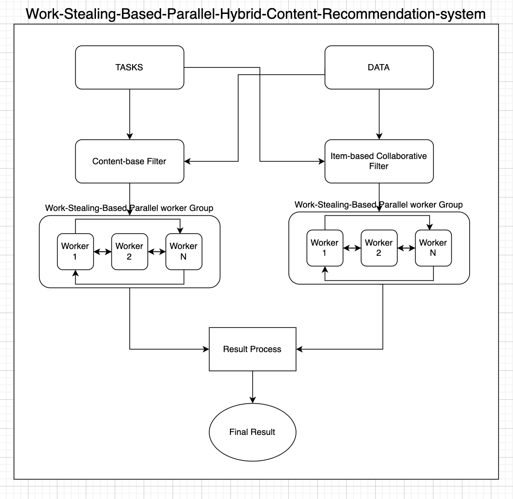

# Work-Stealing-Based Parallel Hybrid Content Recommendation System

## 1. Introduction

### 1.1 Problem Statement

This project addresses limitations in existing recommendation systems on e-commerce platforms by introducing a Work-Stealing-Based Parallel Hybrid Content Recommendation System. Leveraging a combination of collaborative and content-based filtering, the system enhances recommendation accuracy and diversity. Work-stealing techniques are employed to optimize parallel processing for improved system efficiency.

## 2. DataSet

### 2.1 DataSet Overview

A custom dataset was created for illustration purposes, with a focus on proving the system's correctness. The dataset generation allows for random large data creation based on user-defined configurations in the `config.json` file. The system recommends products based on user shopping carts and previously rated items.

### 2.2 DataSet Generation

To run with the sample data set:
```bash
go run recommend.go sample (Number of Workers for Content-based) (Number of Workers for Collaborative filter)
```

To run with the random data set:
Set up parameters in `config.json` and run:
```bash
go run recommend.go random (Number of Workers for Content-based) (Number of Workers for Collaborative filter)
```

### 2.3 Analysis Graph Generation

```bash
python3 analysis.py
```

## 3. Parallel Solutions
### 3.1 Implementation Overview

The hybrid recommendation system utilizes pipelining and Bulk Synchronous Parallelism (BSP). Pipelining passes information through each stage, while BSP ensures synchronization between tasks and results. The system processes recommendations for a user through both filters, enhancing efficiency.

### 3.2 Challenges Faced

Generalizing the pipeline for diverse tasks posed a challenge. Go Generics were used to handle different tasks, ensuring a unified approach across various applications.

## 4. Task Queue and Work Stealing

### 4.1 Performance

Utilizing a work-stealing-based queue in the recommendation system significantly enhances efficiency by addressing the inherent challenges associated with varying task sizes and dynamic workloads. In traditional parallel processing systems, tasks are often distributed equally among workers, leading to potential imbalances when tasks vary in complexity. Work-stealing alleviates this issue by allowing workers with lighter workloads to proactively "steal" tasks from those with heavier loads. This adaptive mechanism ensures that the overall system remains well-balanced, preventing bottlenecks caused by a few workers processing particularly large or complex tasks. The work-stealing approach optimizes resource utilization, leading to improved parallelism and responsiveness in the system. This dynamic task allocation strategy is particularly beneficial in scenarios like content recommendation, where tasks, such as processing recommendations for different users, can vary significantly in computational requirements.

